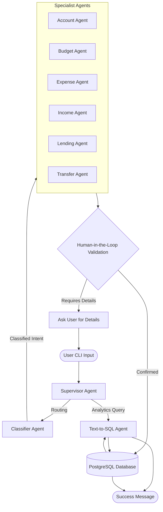

<br/>
<div align="center">
<a href="https://github.com/SarJ2004/WhatsMyNote">

</a>
<h3 align="center">WhatsMyNote</h3>
<p align="center">
<strong>An intelligent, fully conversational financial memory system.</strong><br/>
Control your lending, borrowing, expenses, income, and transfers through pure natural language right from your terminal.
<br/>
<br/>
<a href="https://pypi.org/project/whatsmynote/">View on PyPI</a>
·
<a href="https://github.com/SarJ2004/WhatsMyNote/issues">Report Bug</a>
·
<a href="https://github.com/SarJ2004/WhatsMyNote/issues">Request Feature</a>
</p>

[](https://pypi.org/project/whatsmynote/)
[](https://opensource.org/licenses/MIT)
[](https://pypi.org/project/whatsmynote/)
[](https://github.com/SarJ2004/WhatsMyNote/network/members)
[](https://github.com/SarJ2004/WhatsMyNote/stargazers)
</div>

---

## 📑 Table of Contents
- [About The Project](#-about-the-project)
  - [Architecture & Tech Stack](#-architecture--tech-stack)
- [Getting Started (For Users)](#-getting-started-for-users)
  - [Installation](#installation)
  - [First Run & Authentication](#first-run--authentication)
- [Documentation & Features](#-documentation--features)
- [Local Development (For Contributors)](#-local-development-for-contributors)
- [License](#-license)

---

## 🌟 About The Project

Tracking finances shouldn't require complex spreadsheets, clunky UIs, or manual data entry. **WhatsMyNote** brings the power of state-of-the-art Large Language Models (LLMs) directly to your terminal. 

Just type what happened naturally. The AI will instantly parse your intent, validate the transaction using a Human-in-the-Loop mechanism (if it's complex), and persist it securely to your database. 

**Say goodbye to manual tracking:**
> *"I spent $15 on coffee today using my HDFC account."*  
> *"My friend John borrowed $50 from me for lunch."*  
> *"Show me my expenses for this month as a chart."*  

### 🏗 Architecture & Tech Stack

WhatsMyNote uses a powerful Multi-Agent Architecture powered by LangGraph. A Supervisor agent routes your query to the exact specialist agent needed to handle your request. 



- **Language:** Python
- **AI/LLM Framework:** LangGraph, LangChain, Groq (Llama-3)
- **Data Validation:** Pydantic
- **Database & Persistence:** SQLAlchemy & PostgreSQL (hosted on Render/Supabase)
- **Authentication:** Supabase OAuth (Google/GitHub)
- **CLI UI:** Rich

> **Deep Dive:** Check out the [Core Concepts & Architecture](docs/core_concepts.md) page for a full breakdown of the multi-agent system.

---

## 🚀 Getting Started (For Users)

### Installation

The recommended way to install WhatsMyNote is directly from PyPI. Ensure you have **Python 3.11+** installed.

```bash
# We highly recommend using uv for lightning-fast installation!
uv tool install whatsmynote

# Or standard pip:
pip install whatsmynote
```

### First Run & Authentication

After installing, simply type the command below in your terminal:

```bash
whatsmynote
```

1. You will be prompted to log in via your browser using Supabase (Google/GitHub).
2. The CLI will securely store your token locally. 
3. The AI will guide you through setting up your first Default Account and your monthly Budgets.
4. You are ready to chat!

> **Full Guide:** Read the [Getting Started Guide](docs/getting_started.md) for detailed CLI examples and screenshots.

---

## 📚 Documentation & Features

WhatsMyNote supports an extensive array of financial primitives. Dive into the detailed documentation for each capability below:

| Feature | Description |
|---|---|
| [**Accounts**](docs/features/accounts.md) | Manage multiple bank accounts, cash wallets, and set defaults. |
| [**Budgets**](docs/features/budgets.md) | Track your spending limits across categories (e.g., Food, Rent). |
| [**Expenses**](docs/features/expenses.md) | Log spending, automatically categorized against your budgets. |
| [**Income**](docs/features/income.md) | Track your salary, freelance gigs, and incoming funds. |
| [**Lending & Borrowing**](docs/features/lending.md) | Never forget who owes you money, and who you owe. |
| [**Transfers**](docs/features/transfers.md) | Move money seamlessly between your own accounts. |
| [**Analytics (Text-to-SQL)**](docs/analytics.md) | Ask the AI complex questions ("What did I spend on Food last week?") and it will instantly write and execute secure SQL to show you beautiful charts. |

---

## 🛠 Local Development (For Contributors)

If you'd like to contribute to the codebase or run the backend completely locally, you'll need [`uv`](https://github.com/astral-sh/uv) installed.

1. **Clone the repo:**
   ```bash
   git clone https://github.com/SarJ2004/WhatsMyNote.git
   cd WhatsMyNote
   ```

2. **Environment Setup:**
   ```bash
   cp .env.sample .env
   ```
   *You will need to provide your own `GROQ_API_KEY` and Supabase keys in the `.env` file.*
   > **Important:** For `DATABASE_URL`, use the Supabase **Direct connection** (Port 5432 or Session mode). Do NOT use the Transaction Pooler (Port 6543), as it breaks SQLAlchemy schema migrations during initial setup.

3. **Install Dependencies:**
   ```bash
   uv pip install -e .
   ```

4. **Run the Backend locally:**
   ```bash
   uv run uvicorn backend.main:app --reload
   ```

5. **Test the CLI:**
   Open a new terminal window, ensure `ENV="dev"` is in your `.env`, and run:
   ```bash
   uv run whatsmynote
   ```

---

## 📄 License

Distributed under the MIT License. See [LICENSE](LICENSE) for more information.
