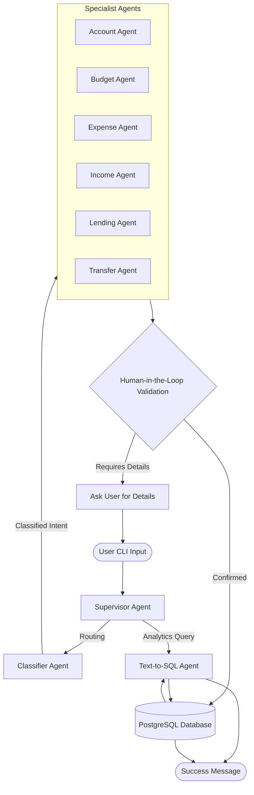

# Core Concepts & Architecture

**WhatsMyNote** is not just a wrapper around an LLM. It is a robust, stateful Multi-Agent System designed specifically for parsing, validating, and persisting highly unstructured financial data from natural language.

## System Architecture

The core of WhatsMyNote is powered by **LangGraph**. Instead of relying on a single monolithic LLM prompt to do everything, the system is divided into specialized AI Agents. 

## The Multi-Agent Workflow

When you type a message like *"I spent $15 on coffee today"*, here is exactly what happens under the hood:

### 1. The Supervisor
The Supervisor acts as the orchestrator. It receives your raw text and determines if you are:
- Asking an analytical question (*"How much did I spend this month?"*)
- Giving a financial command (*"I spent $15"*)

### 2. The Classifier
If it's a financial command, the Supervisor hands the text to the **Classifier Agent**. The Classifier's only job is to categorize the intent into one of six rigid buckets: `ACCOUNT`, `BUDGET`, `EXPENSE`, `INCOME`, `LENDING`, or `TRANSFER`. 

### 3. Specialist Extraction (Pydantic)
Once classified (e.g., as an `EXPENSE`), the text is routed to the **Expense Specialist Agent**. This agent uses strict **Pydantic** schemas combined with LangChain's structured output tools to aggressively extract the exact variables needed:
- Amount: `15.00`
- Category: `Food/Coffee`
- Account: `Default`
- Date: `Today`

### 4. Human-in-the-Loop (HITL) Validation
**This is the most critical safety feature of WhatsMyNote.**
LLMs can hallucinate, and you don't want hallucinations mutating your financial database. 

Before *any* data is committed to the database, the system enters a validation state. If the extraction looks dangerous, incomplete, or ambiguous, the AI halts execution and asks you a clarifying question in the CLI. 

If the extraction is perfect, it will still output a summary of what it understood, and wait for your implicit or explicit approval before persisting it.

### 5. Persistence
Once validated, the data is mapped to SQLAlchemy ORM models and securely committed to your PostgreSQL database hosted on Supabase, guarded by Row Level Security (RLS) tied to your OAuth User ID.

## Global Memory & State

WhatsMyNote maintains a "Global State" during your chat session. 
If you say *"I bought coffee for $5"*, and then follow up with *"And a sandwich for $10"*, the system's Short-Term Memory understands the context that the $10 is also an expense.

Furthermore, it queries your database for Long-Term Context. It knows what accounts you have, what categories you usually spend in, and what your default fallback account is, meaning you don't have to redundantly specify details.
